# Stocks Android App
An android app for virtual stock trading. 

## Demo
[]()

## Screen shots
### Home page

<p float="left">
  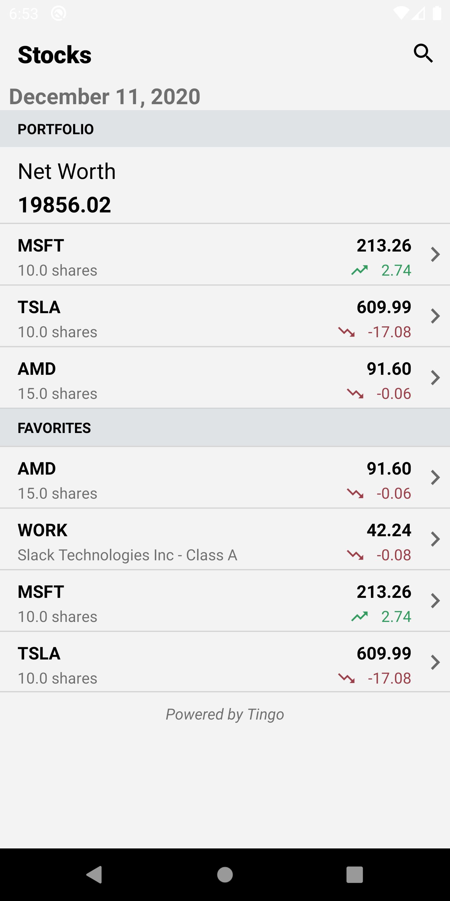
  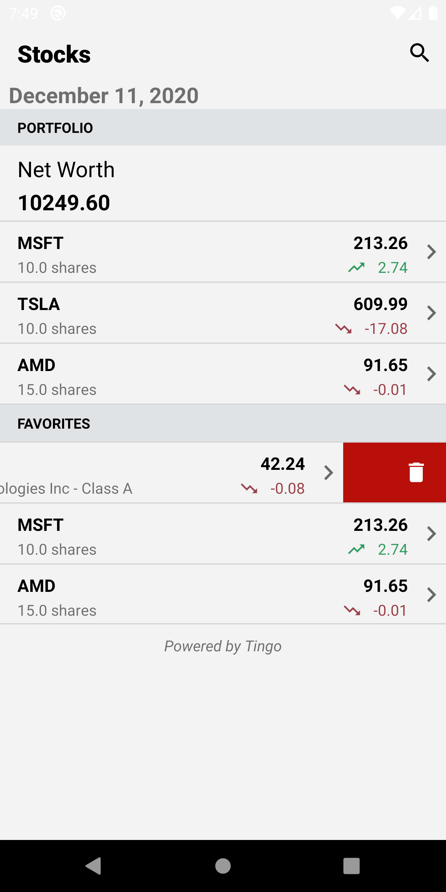
  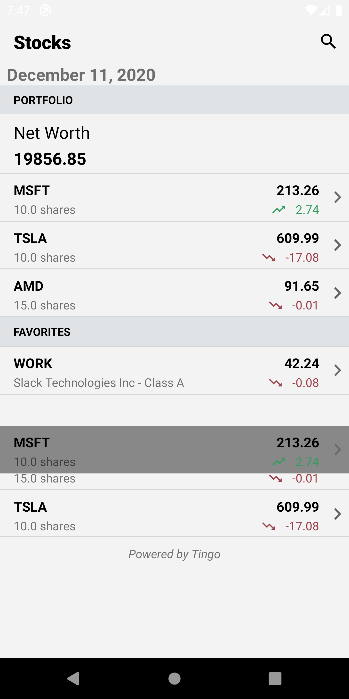
  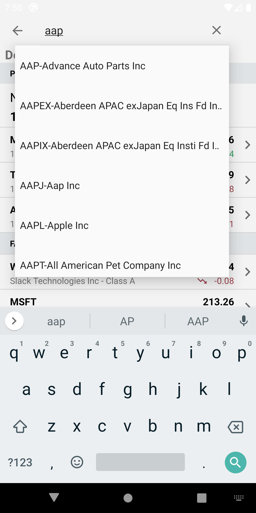
</p>


### Stock Details page
<p float="left">
  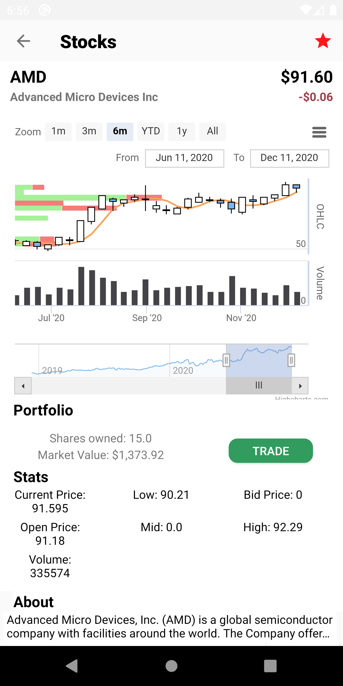
  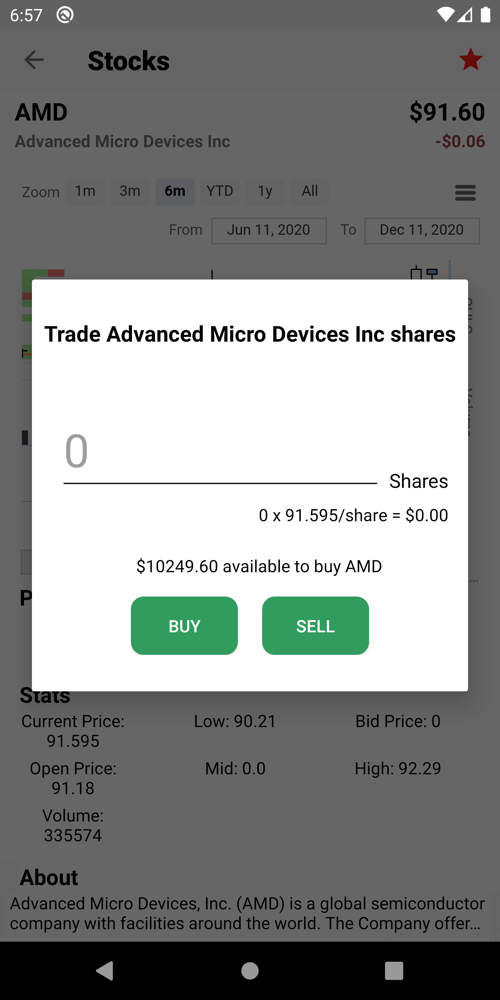
  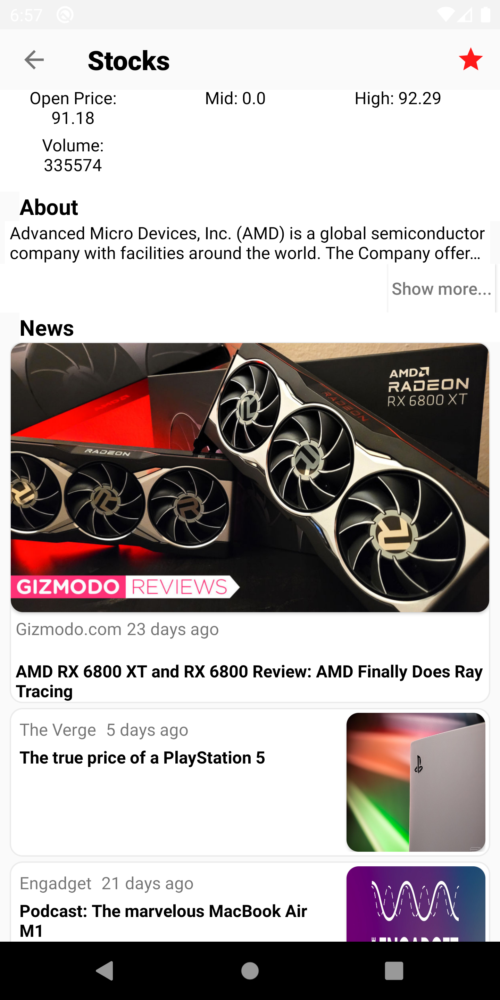
  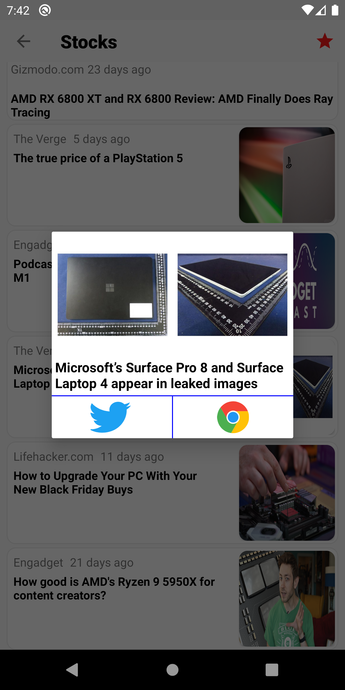
</p>


## Developed by
**Akash Kumar Singh**

## Version & Latest Updates (2026)

### Recent Upgrades & Improvements
All dependencies have been upgraded to latest stable versions for better security, performance, and compatibility.

**Updated SDK Versions:**
- compileSdkVersion: 30 → **34** (Latest Android API)
- buildToolsVersion: 30.0.2 → **34.0.0**
- targetSdkVersion: 30 → **34**
- minSdkVersion: 16 → **21** (Better modern Android features)
- Java Version: 1.8 maintained (Compatible with Android 14+)

**Updated Dependencies:**
| Library | Previous | Updated |
|---------|----------|---------|
| androidx.appcompat | 1.2.0 | **1.6.1** |
| Android Material | 1.2.1 | **1.11.0** |
| ConstraintLayout | 2.0.4 | **2.1.4** |
| Volley | 1.1.1 | **1.2.1** |
| Gson | 2.8.6 | **2.10.1** |
| Lifecycle | 2.2.0 | **2.7.0** |
| Picasso | 2.5.2 | **2.8** |
| OkHttp | N/A | **4.11.0** (Added) |
| RecyclerView | N/A | **1.3.2** (Added) |
| JUnit | 4.+ | **4.13.2** |
| Espresso | 3.3.0 | **3.5.1** |

**Benefits of Upgrades:**
✅ Enhanced security patches and vulnerability fixes  
✅ Improved performance and memory optimization  
✅ Full Android 14+ compatibility  
✅ Better Material Design 3 support  
✅ Updated testing frameworks  
✅ Latest lifecycle management features  

## Migration Guide for Upgrades

### After Updating to Latest Version

Follow these steps to ensure smooth integration:

1. **Update Android Studio**
   - Open Android Studio and go to `Help` → `Check for Updates`
   - Install the latest version if available

2. **Sync Gradle Files**
   - In Android Studio: `File` → `Sync project with Gradle Files`
   - Wait for all dependencies to download and sync

3. **Update Emulator**
   - Android SDK 34 is recommended
   - Download from AVD Manager if not already installed
   - Update or create emulator with API 34

4. **Build Configuration**
   - Clean: `Build` → `Clean Project`
   - Rebuild: `Build` → `Rebuild Project`
   - Resolve any compatibility issues that appear

5. **Test Your App**
   - Run on emulator: `Run` → `Run 'app'`
   - Test all key features (search, portfolio, favorites, trading)
   - Check for any runtime warnings or errors

### Breaking Changes to Be Aware Of

- **minSdkVersion now 21**: Features using API < 21 won't work. Check if your code uses deprecated APIs.
- **Material Design Updates**: Some UI elements may need adjustment for Material 3 compliance.
- **Lifecycle Changes**: If using custom lifecycle observers, verify compatibility.

## Summary

This Android app provides a platform for stocks trading, including, features such as searching company stock details, buying/selling stocks, keeping track of stock porfolio/favorites, viewing stock SMA charts and news, allowing sharing news on twitter for a given stock. Custom Nodejs backend deployed using GCP is used for all API calls. The backend uses [Tingo API](https://api.tiingo.com/) for all stock related data, and [News API](https://newsapi.org/) for displaying stock related news. [Highcharts](https://www.highcharts.com/) is used for displaying the SMA chart data for a given ticker.


## Java File descriptions
* ```ApiCall.java```: the class that allows making api GET requests using Volley
* ```AutoSuggestApdapter.java```: Adpater used for autocomplete search feature. 
* ```Company.java```: used to create a Company object that includes the company name, ticker, number of company shares owned, last company price, price change,  
* ``` News.java```: used to create a news object that will be used to display the list of news related to given stock
* ```CompanyHeaderViewHolder.java```: the header view holder for the sectioned RecyclerView in home page. Currently we only have two sections portfolio and favorites.
* ```CompanyItemViewHolder.java```: item view holder for a given section of RecyclerView. This is used to display the company information inside either portfolio or favorites
* ```CustomDividerItemDecoration.java```: extends the DividerItemDecoration class for adding vertical lines between items in RecyclerView
* ```CustomGridAdapter.java```: extends base adpater for storing company price summary details (such as last price, previous close, volume, bid size, etc) to be displayed using gridView
* ```CustomNewsAdapter.java```: extends RecyclerView.Adapter<CustomNewsAdapter.ViewHolder> for storing a list of all news articles related for a given stock. Also contains the ViewHolder class extention of  RecyclerView.ViewHolder to be used to display these news item inside a RecyclerView
* ```MainActivity.java```: extends AppCompatActivity. The main activity of the app that acts as the home page of the app. Home page contains toolbar for searching stocks, the current date, Networth of all the stocks plus excess cash (the app starts with 20,000 cash and no stocks), and portfolio and favorites section.
* ```DetailsActivity.java```: extends AppCompatActivity. This is the stock details activity that is reached once the user clicks search icon in home page(the main activity) for a selected stock, or clicks on the company item in either protfolio or favorite section of home page. Contains stock summary, price details, options for trading this stock, and viewing stock related news article.
* ```FavoriteSection.java```: extends io.github.luizgrp.sectionedrecyclerviewadapter.Section 3rd party Android library to create favorites section inside the home page Recyclerview
* ```PortfolioSection.java```: extends io.github.luizgrp.sectionedrecyclerviewadapter.Section 3rd party Android library to create portfolio section inside the home page Recyclerview
* ```ItemMoveCallback.java```: extends ItemTouchHelper.Callback to allow rearranging the positions of company items inside portfolio or favorites section
* ``` SwipeToDeleteCallback.java```; extends ItemTouchHelper.Callback to allow removing stocks/company items from favorites sections only.
* ```LocalStorage.java```: class used to manage the company data stored in the SharedPreferences. This is used to keep track of all the company items inside either portfolio section or favorites section so if user restarts the app, the stock inside portoflio or favorites section are not lost. Reinstalling the app will however, clear the local storage (SharedPreferences)
* ```SplashActivity.java```: the very first activity that runs when the app is load. It display the app logo until the home page is loaded

## Usage
### Running the app:
* Clone the repo using `git clone https://github.com/rehmanis/stocks-android.git`
* Open the app inside [Android Studio](https://developer.android.com/studio)
* Make sure to use JDK 1.8.0 (The project uses Java 8)
* In Android Studio under `File` click `Sync project with Grade Files`.
* Add the `Pixel 2 XL 28` (App has not been tested with other emulator device) emulator device by clicking `AVD Manager` as shown below. 

  [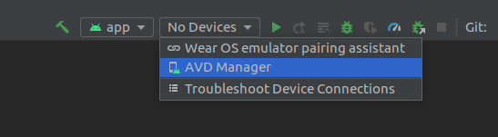](). 
  
* On the pop up window, click the `Create Virtual Device` button and add `Pixel 2 XL 28` [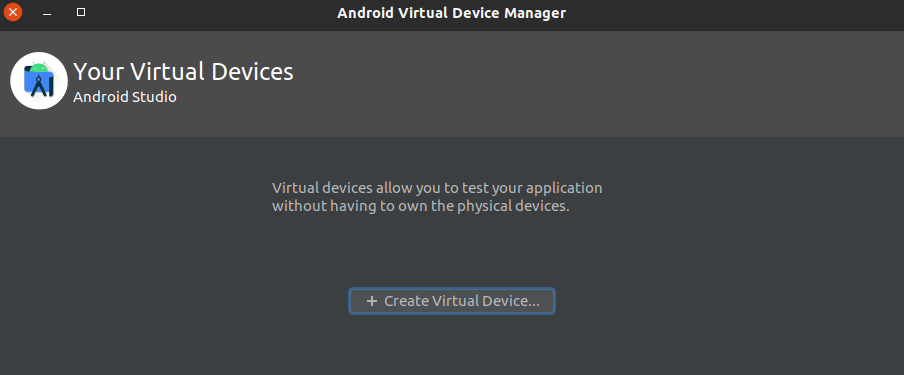]()
* Once you have successfully added the virtual device, you should see it as shown below. Now you can click the run button and it should load the emulator with the app.
[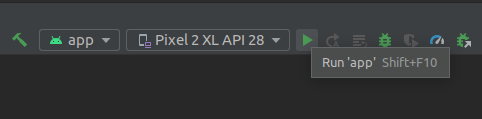]()
* The emulator will launch and will automatically open the stock app as shown below. [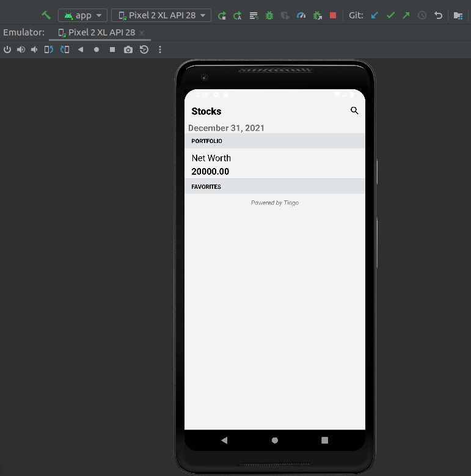]()

## Backend Setup & Configuration

### Important: Backend is Required
**⚠️ Note:** The GCP backend has been removed. **No API calls will work** (auto-complete, search, stock data) without a functional backend. The app requires a backend to retrieve stock data and news.

### Backend Deployment Options

#### Option 1: Deploy Node.js Backend
The backend code is available here:
- **Full Node.js Version**: [stocks-angular backend](https://github.com/rehmanis/stocks-angular/blob/master/routes/api.js)
- **Serverless Version**: [AWS Lambda/Google Cloud Functions](https://github.com/rehmanis/CSCI571-Stocks-Serverless/blob/master/index.js)

You can deploy on:
- **Google Cloud Platform (GCP)** - Cloud Run or App Engine
- **AWS** - Lambda with API Gateway
- **Heroku** - For quick testing
- **Local machine** - For development

#### Option 2: Update API Endpoints
Modify the API URLs in the Android app to point to your deployed backend:
- [MainActivity.java](https://github.com/rehmanis/stocks-android/blob/master/app/src/main/java/com/example/csci571andriodstocks/MainActivity.java#L61-L62) (Lines 61-62)
- [DetailsActivity.java](https://github.com/rehmanis/stocks-android/blob/master/app/src/main/java/com/example/csci571andriodstocks/DetailsActivity.java#L56-L59) (Lines 56-59)

Replace the hardcoded URLs:
```java
public static final String SEARCH_URL = "https://YOUR_BACKEND_URL/api/search/";
public static final String PRICE_URL = "https://YOUR_BACKEND_URL/api/price/";
```

### API Keys Required

The backend requires API keys from third-party services. You must obtain these and configure them in your backend:

1. **Tiingo API** (Stock Data)
   - Sign up: [https://api.tiingo.com/](https://api.tiingo.com/)
   - Get your API token from the dashboard
   - Add to backend configuration

2. **News API** (Stock News)
   - Sign up: [https://newsapi.org/](https://newsapi.org/)
   - Get your API key
   - Add to backend configuration

⚠️ **Security Note:** Never hardcode API keys in the app or commit them to version control. Use environment variables or secure configuration management in your backend.

### Example Backend Configuration

In your Node.js backend (e.g., routes/api.js), set up your API keys:
```javascript
const TIINGO_API_KEY = process.env.TIINGO_API_KEY; // Use environment variable
const NEWS_API_KEY = process.env.NEWS_API_KEY;     // Use environment variable
```

Then in your deployment environment, set these variables:
- **GCP**: Use Secret Manager or Cloud Build environment variables
- **AWS Lambda**: Use Lambda environment variables or Secrets Manager
- **Local**: Use .env file with dotenv package
- **Heroku**: Use Config Vars in your app settings

## Dependencies

### Project Requirements
- **Java**: JDK 1.8.0 (Java 8)
- **Android SDK**: API Level 30 (recommended API 33+)
- **Android Studio**: Latest version recommended
- **Gradle**: Configured in the project (gradlew)

### Current Dependencies
- **androidx.appcompat**: 1.2.0
- **Android Material**: 1.2.1
- **Volley**: 1.1.1 (HTTP requests)
- **Gson**: 2.8.6 (JSON parsing)
- **Picasso**: 2.5.2 (Image loading)
- **Sectioned RecyclerView Adapter**: 3.2.0
- **Espresso**: 3.3.0 (Testing)

⚠️ **Note:** Some dependencies are from 2020-2021. Consider updating to latest versions for:
- Better security patches
- Improved performance
- Android 14+ compatibility

## Known Issues & Limitations

1. **Backend is Down** - Original GCP backend has been removed and must be redeployed
2. **API Keys Hardcoded** - Current backend uses hardcoded API keys (security risk). Use environment variables instead.
3. **Outdated Dependencies** - Some libraries could be updated for better compatibility
4. **Android API Level** - Target SDK 30 could be updated to SDK 34+ for latest Android features
5. **Limited Testing** - Only tested with Pixel 2 XL emulator (API 28)

## Troubleshooting

### "No API calls work"
- Ensure backend is deployed and running
- Verify API URLs are correctly configured in MainActivity.java and DetailsActivity.java
- Check that API keys are valid in your backend
- Look at logcat output for network errors

### "Search/AutoComplete not working"
- Check if backend is accessible from the emulator
- Use `adb logcat` to see detailed error messages
- Verify internet permission is granted: `android.permission.INTERNET`

### "Build fails with Gradle error"
- Ensure you're using JDK 1.8.0
- Run `Sync project with Gradle Files` in Android Studio
- Clear and rebuild the project

## Future Improvements

- [ ] Update dependencies to latest versions
- [ ] Migrate from Volley to Retrofit2 or OkHttp
- [ ] Add unit tests
- [ ] Support Android 14+ features
- [ ] Implement secure API key management
- [ ] Add offline caching for stock data
- [ ] Dark mode support

## Upgrade Checklist for Developers

If you're working with this updated version, follow this checklist:

### Before Building
- [ ] Java 8 or higher installed
- [ ] Android Studio 2023.1 or newer
- [ ] Gradle 8.0+ (auto-managed by Android Studio)
- [ ] Android SDK with API 34 installed

### After Pulling Latest Changes
- [ ] Run `File` → `Sync project with Gradle Files`
- [ ] Clear build cache: `Build` → `Clean Project`
- [ ] Rebuild project: `Build` → `Rebuild Project`
- [ ] Resolve any dependency conflicts
- [ ] Check for SDK manager updates

### Testing Requirements
- [ ] Test on emulator with Android 14 (API 34)
- [ ] Test backwards compatibility on Android 5.0+ (API 21)
- [ ] Verify all network calls work with updated Volley/OkHttp
- [ ] Test image loading with Picasso 2.8
- [ ] Verify RecyclerView animations and adaptations

### Code Cleanup (Optional)
- [ ] Replace deprecated `com.android.support` with `androidx` equivalents
- [ ] Update any custom drawable/style files for Material 3
- [ ] Review and update color schemes for modern Material palette
- [ ] Test accessibility features with latest tools

## Known Deprecations Resolved in This Update

✅ **Removed**: `com.android.support:design:28.0.0-rc01` (Use `com.google.android.material:material:1.11.0`)  
✅ **Removed**: Hardcoded min SDK version of 16 (Updated to 21 for better compatibility)  
✅ **Updated**: All legacy AppCompat dependencies to modern androidx equivalents  
✅ **Added**: OkHttp 4.11.0 for better HTTP client capabilities  
✅ **Added**: RecyclerView 1.3.2 for enhanced list handling  

## License
MIT License

Copyright (c) 2020-2026 Shamsuddin Rehmani & Akash Kumar Singh

Permission is hereby granted, free of charge, to any person obtaining a copy
of this software and associated documentation files (the "Software"), to deal
in the Software without restriction, including without limitation the rights
to use, copy, modify, merge, publish, distribute, sublicense, and/or sell
copies of the Software, and to permit persons to whom the Software is
furnished to do so, subject to the following conditions:

The above copyright notice and this permission notice shall be included in all
copies or substantial portions of the Software.

THE SOFTWARE IS PROVIDED "AS IS", WITHOUT WARRANTY OF ANY KIND, EXPRESS OR
IMPLIED, INCLUDING BUT NOT LIMITED TO THE WARRANTIES OF MERCHANTABILITY,
FITNESS FOR A PARTICULAR PURPOSE AND NONINFRINGEMENT. IN NO EVENT SHALL THE
AUTHORS OR COPYRIGHT HOLDERS BE LIABLE FOR ANY CLAIM, DAMAGES OR OTHER
LIABILITY, WHETHER IN AN ACTION OF CONTRACT, TORT OR OTHERWISE, ARISING FROM,
OUT OF OR IN CONNECTION WITH THE SOFTWARE OR THE USE OR OTHER DEALINGS IN THE
SOFTWARE.
    
